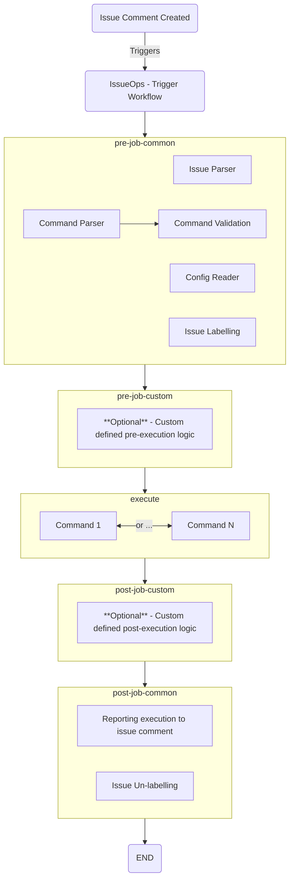

# IssueOps Action

## Description

The IssueOps Action is a robust framework designed to streamline the development of an IssueOps solution. It provides a set of common functionalities that allow you to read issues, perform basic validation, and generate reports. One of the key features of this framework is its ability to execute these tasks in parallel using a matrix, significantly improving efficiency and speed. This framework serves as a quick bootstrap for your IssueOps development, enabling you to focus on building solutions rather than setting up the groundwork.

## Method of Action

At the highest level, the operation of the framework is in three phases although each phases is sub divided for extensibility:

- Pre-execute
  - Common
  - Custom
- Execute
  - Command Execution Logic
- Post execute
  - Custom
  - Common

### Pre-execute phase

The pre-execute phase is designed to perform necessary actions prior to the execution of commands.

#### Pre-execute `common`

This common section performs the main activites provided by this framework. This includes commons behaviours to read configuration, parse the issues text and commands in the comments. This includes validation and some other features like adding a label to the issue during execution. This workflow should not be changed by the implementor.

#### Pre-execute `custom`

If custom logic needs to be applied prior to the execution of a command, then this is the section which should be modified. Implementors are able to add additional functionality and custom logic here.

### Execute phase

The execute workflow itself will usually be a set of `if` statements which control the execution of jobs determined by the name of the command being executed. Those jobs would usually be defined by separate reusable workflows.

Implementors have to implement their own business logic here.

### Post-execute phase

The post-execute phase is designed to perform necessary actions after the execution of commands.

#### Post-execute `custom`

This is the workflow which should be customised to define any specific actions which should occur after the execution of a command.

#### Post-execute `common`

This common section performs the main activites provided by this framework. This includes commons behaviours to report on the output of execution and unlabelling the issue.

### Visual representation of the workflow



## Configuration

Configuration is stored in `.json` files under the config directory.

### `issueops.json`

This configuration is used to apply settings to the operation of the issueops framework. Currently the settings are:

| Property                         | Data type | Description                                                                                                                    |   |   |   |
|----------------------------------|-----------|--------------------------------------------------------------------------------------------------------------------------------|---|---|---|
| create_comment_for_workflow_runs | boolean   | When enabled, the framework will create issues stating that the process has started and completed referencing the workflow id. |   |   |   |
| label_during_execution           | string    | When set, this will add a label to the issue whilst the framework is executing a command.                                      |   |   |   |

### `commands.json`

The `commands.json` contains an array of commands which are valid options within your implementation, as per this example:

```jsonc
[
    {  "command": "dev-command", "environment": "dev", "report": { "type": "markdown" } },
    {  "command": "test-command", "environment": "test", "report": { "type": "markdown" } },
    {  "command": "prod-command", "environment": "prod", "additionalParams": ["input1", "input2", "input3"], "report": { "type": "markdown" } }
]
```

#### `command`

The value for command relates to the comment which needs to be added to a comment with a leading `/` in order to be picked up by the framework, i.e. if `"command": "dev-command"` then the activation for this command would be to add a comment to an issue as `/`

#### `environment`

Environment is used for situations where "static" pieces of configuration need to change between different commands. This is just a string name and will be matched in a heirachical way with config files to override default custom config with those which are environment specific.

#### `additionalParams`

Additional parameters can be specified by name. This is used for accepting additional inputs with commands. For example, a configuration like `"command": "my-command", "additionalParams": ["servername"], "report": { "type": "markdown" }` was used then executing the following:

`/my-command my-server`

Would see the value `my-server` added to the values attribute `servername`. For example the values parsed by the framework for the command would look like:

```jsonc
{
  "command": "my-command",
  "additionalValues": {
    "servername": "my-server"
  },
  "skip": false
}
```

#### `report`

This allows you to return data from the execution phase and return data in the resulting comment to display information about the execution. There are two types: `markdown` and `table`. `markdown` allows you to control the output, `table` takes structures `json` data and helpfully formats this as a table using column metadata in the configuration.

In essence to get the reporting to work, you need to create a report `.json` file and use the framework's upload functionality:

```yaml
      - name: Create Migration Report
        if: always()
        run: |
          reportvalue="## My Report"
          jq --null-input --arg markdown "${reportvalue}" '{ "markdown": $markdown }' > execute-report.json
```

Following this step, you should call the framework's `uploadExecuteReport` wrapper action:

```yaml
      - name: Upload Execution Report
        id: upload-execution-report
        uses: ActionsDesk/issueops-action/wrappers/upload-execute-report@v1
        with:
          differentiator: ${{ needs.manage-inputs.outputs.source_repo }}
```

##### `markdown`

```jsonc
{
  /* ... */ 
   "report": { "type": "markdown" }
}
```

The Markdown report type is designed to make reporting straightforward using the markdown format. During the execution phase of your report, you should create a `.json` file with a single attribute named `markdown` and output that to a file named as `execute-report.json`.

A value for `differentiator` is important when executing this as a matrix (using only one dimension) as this is used to help identify the job number in the workflow. In this case, it should match the sole key from the matrix.

When not executing in a matrix you can omit this value.

##### `table`

```jsonc
{
  /* ... */ 
 "report": {
  "type": "table",
      "columns": [
        { "attribute": "id", "title": "ID" },
        { "attribute": "name","title": "Name" },
        { "attribute": "age", "title": "Age" }
      ]
    }
}
```

In this example, having `execute-report.json` file containing an array of values having matching attributes from the config will result in the issue comment creation with a markdown table containing the configured columns. The output report file may contain additional data, but only configured columns will show in the comment.

### `fields.json`

Fields configuration is used to parse data from the issue body. The expected format of data in the issue body is that of a body created by using an [issue forms](https://docs.github.com/en/communities/using-templates-to-encourage-useful-issues-and-pull-requests/syntax-for-issue-forms). When users are entering values in to the form, markdown lists can be used to collect multiple values.

| Property | Data type | Description                                                                                                                                         |
|----------|-----------|-----------------------------------------------------------------------------------------------------------------------------------------------------|
| name     | string    | This property determines the property which will be populated by the parser after reading the template.                                             |
| label    | string    | This is the label used in the issue form which needs to be matched in order to find the value.                                                      |
| regex    | string    | If set, this will validate that the content of this value in the issue body meets the specified pattern.                                            |
| matrix   | boolean   | If set for one of the fields, this will populate a special matrix value from the parser. Particular use is when the input includes a markdown list. |
| required | boolean   | If set, enforces that the value is required and cannot be blank.                                                                                    |

### `custom-config.json` and `custom-config-ENVIRONMENT.json`

Using these config files provides a way to audit any changes to the configuration, and more clear way to store structured values if required. Much like variables and environment variables in a github repository, this configuration allows you to set values which are required by your execution. Adding properties here will make that configuration available, and if a property is overriden by the custom-config matching an `ENVIRONMENT` name from the command configuration, then that will be available over the top of the custom config.

## Available Actions

The IssueOps Framework provides several wrapper actions that can be used directly in your workflows:

### Setup Action

```yaml
- name: Setup IssueOps
  uses: ActionsDesk/issueops-action/wrappers/setup@v1
```

### Upload Execution Report Action

```yaml
- name: Upload Execution Report
  uses: ActionsDesk/issueops-action/wrappers/upload-execute-report@v1
```

### Add Report Comment Action

```yaml
- name: Add Report Comment
  uses: ActionsDesk/issueops-action/wrappers/add-report-comment@v1
```

### Teardown Action

```yaml
- name: Teardown IssueOps
  uses: ActionsDesk/issueops-action/wrappers/teardown@v1
```

All actions accept an optional `github-token` input that defaults to `${{ github.token }}` if not specified.

## License

IssueOps Framework is licensed under the [LICENSE](issueops-common-logic/LICENSE) file.
